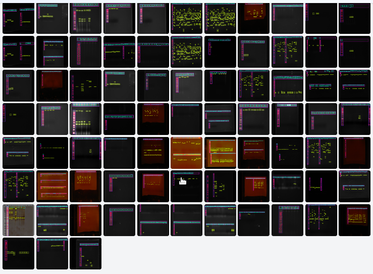

# 🧬 YOLO Models for Electrophoresis

This repository provides **YOLOv5 to YOLOv12** models trained for automatic detection of electrophoresis gel features — including DNA bands, wells, and molecular markers.

> 🔬 Models trained as part of the study:  
> **"Electrophoresis Gels Detection and Analysis Using YOLO"**  
> Clenivaldo Pires da Silva et al., 2025.

---

## 📦 Available Models

| Model      | Filename      | mAP (%) | Size (MB) | Download |
|------------|----------------|---------|-----------|----------|
| YOLOv5     | `yolov5.pt`     | 92.2    | 168.9     | [📥 Download](https://drive.google.com/file/d/1UI7f7f2ZbRZiuZfEonYzeevTrwTX30_v/view?usp=drive_link) |
| YOLOv6     | `yolov6.pt`     | 94.6    | 466.8     | [📥 Download](https://drive.google.com/file/d/17ZXczKwD4bkNz9jJ8ltbXOMiiDABVZ2y/view?usp=drive_link) |
| YOLOv7     | `yolov7.pt`     | 94.3    | 138.7     | [📥 Download](https://drive.google.com/file/d/1wvXcudHQ_yli9Si0CBnaCz_IpIM30MLF/view?usp=drive_link) |
| YOLOv8     | `yolov8.pt`     | 94.8    | 133.5     | [📥 Download](https://drive.google.com/file/d/1FGTrQuH2YCg9h0-bJdbrb2rHgaax_sPG/view?usp=drive_link) |
| YOLOv9     | `yolov9.pt`     | 94.6    | 199.8     | [📥 Download](https://drive.google.com/file/d/174FgwPKwFHsq55TSrMF0WUDFPlmehk9r/view?usp=drive_link) |
| YOLOv10    | `yolov10.pt`    | 93.8    | 62.7      | [📥 Download](https://drive.google.com/file/d/1H6va65SP_RKHhiVpx0TQzKD3Wq9ymXK7/view?usp=drive_link) |
| YOLOv11 ✅ | `yolov11.pt`    | **95.0**| 111.7     | [📥 Download](https://drive.google.com/file/d/1BmSwHPjHC-nPrnu884VBEoRFOMDEOWvA/view?usp=drive_link) |
| YOLOv12    | `yolov12.pt`    | 90.9    | 113.6     | [📥 Download](https://drive.google.com/file/d/116fXm0VluzffuEbw1OuY8w_B1MFWfh-R/view?usp=sharing) |

> ✅ **YOLOv11 is the recommended model**, with the highest accuracy in our experiments.

---

## 🧾 Dataset & Annotations

- **Image count**: 1,230 images (augmented from 246 real gel electrophoresis images)
- **Annotation tool**: [Roboflow](https://roboflow.com)
- **Classes**:
  - `B` – Band
  - `L` – Marker region
  - `M` – Individual marker
  - `P` – Well region
  - `Pc` – Individual well

📂 Public dataset and annotations:  
👉 [Access the dataset on Roboflow Universe](https://app.roboflow.com/lbiomic-laboratorio-de-biotecnologia-microbiana)

---

## ⚙️ Training Configuration

- Framework: [Ultralytics YOLO](https://github.com/ultralytics/ultralytics)
- Transfer learning from: MS COCO
- Image size: 416x416
- Epochs: 2000
- Hardware: NVIDIA RTX 2060 (12GB)

---

## 📜 Citation

If you use these models, please cite:

> Clenivaldo Pires da Silva, Mateus F. T. Carvalho, Yandre M. G. Costa,  
> Franklin C. Flores, Julio C. Polonio, and Claudete A. Mangolim.  
> **"Electrophoresis Gels Detection and Analysis Using YOLO"**, 2025.

---

## 📄 License

These models are available for **academic and research use only**.  
For commercial use, please contact the authors.

